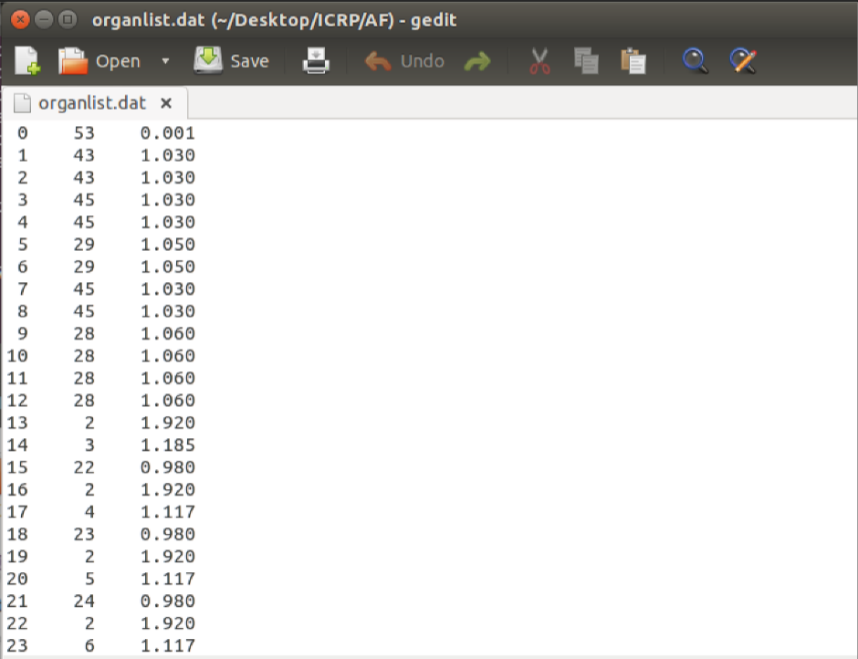
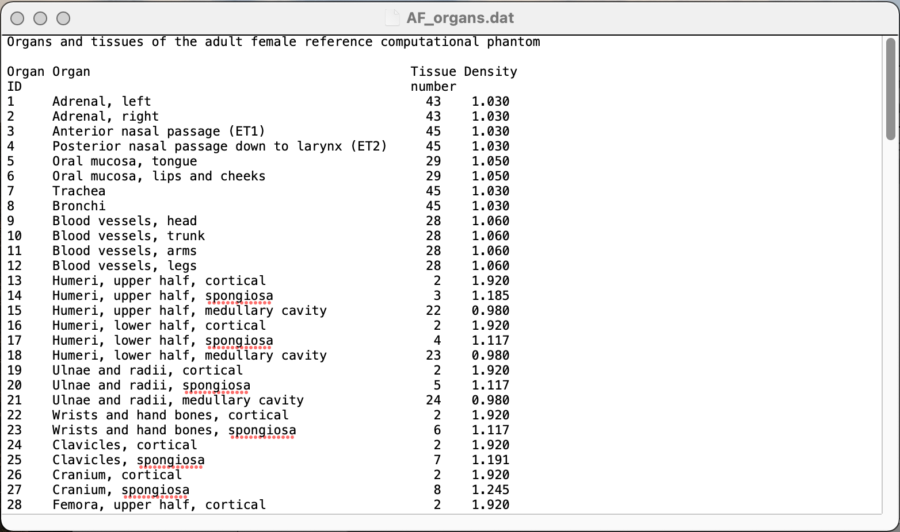

# ReadPhantom: Voxel phantom data processing for PENELOPE simulations

readPhantom is a Python script to read, process, and convert voxel phantom data into files suitable for simulation and visualization with the PENELOPE/penEasy Monte Carlo framework [1,2]. :atom_symbol:

The `readPhantom.py script` is a powerful tool designed to streamline the workflow for researchers and students working with voxel phantoms. It automates the conversion of raw phantom data into structured .vox files required by PENELOPE/penEasy [3,4].

The program is optimized for efficiency, especially when handling large datasets with millions of voxels. It uses Python's numpy and pandas libraries for fast data processing, avoiding slow, line-by-line processing.

## Contextualization
Voxel phantoms are models of the human anatomy consisting of several voxels (i.e. 3D pixels) grouped together to model the human body, assembled from Computed Tomography or Magnetic Resonance Imaging. Monte Carlo (MC) simulations are numerical computations that use random sampling to obtain numerical results, being a common tool in methematics, economics, physics, finance, etc. When coupled with voxel phantoms, MC simulations are widely employed to model radiation with biologic matter and the human body [1, 2]. 

Nonetheless, on the one hand voxel phantom files are almost exclusively available as raw data. On the other hand, different MC softwares only allow voxel phantom loading in specific formats. Therefore, when working with a MC software, you very probably will have to create your own voxel phantom file.

If you want to learn more about voxel phantoms, MC simulations and the origin/purpose of the script, please follow the references.

__Note:__ This program is a modern Python re-implementation of a similar tool originally written in Fortran in 2017, also available in this repository. The ReadMe for the Fortran version is in Annex 1 of Reference [1].

:arrow_right: __References:__

[1] Borbinha J. Organ Dose Estimates in Thorax CT: Voxel Phantom Organ Matching With Individual Patient Anatomy. MSc Thesis, 2017. Available from: [http://hdl.handle.net/10362/](https://run.unl.pt/bitstream/10362/29982/1/Borbinha_2017.pdf) 

[2] Borbinha J, Di Maria S, Madeira P, Belchior A, Baptista M, Vaz P. Increasing organ dose accuracy through voxel phantom organ matching with individual patient anatomy. Radiat Phys Chem. 2019 Jun;159:35–46. doi: [10.1016/j.radphyschem.2019.02.014](https://www.doi.org/10.1016/j.radphyschem.2019.02.014)

[3] FNEA (2019), PENELOPE 2018: A code system for Monte Carlo simulation of electron and photon transport: Workshop Proceedings, Barcelona, Spain, 28 January – 1 February 2019, OECD Publishing, Paris, doi: [doi.org/10.1787/32da5043-en](https://doi.org/10.1787/32da5043-en) 

[4] Sempau J., Badal A., Brualla L. A PENELOPE-based system for the automated Monte Carlo simulation of clinacs and voxelized geometries-application to far-from-axis fields. Med Phys. 2011;38(11):5887–5895. doi:[10.1118/1.3643029](https://doi.org/10.1118/1.3643029)

## Description

### Input files:

- __Phantom file:__ Contains organ IDs for each voxel, ordered continuously along x, y, and z axes.
  - Can be either in either ASCII or binary format.
  - May come in many formats: '.dat','.txt','.csv', etc.
  - In older phantom files, there may be a header present, that needs to be removed, for the script to work properly.

- __Organlist file:__ Lists at least Organ ID, Material ID and Density in columns, not necessarily in this order.
  - This is a very important file, it is the 'key' that converts Organ ID numbers in the raw voxel phantom file into Material ID and Density data readable by PENELOPE/penEasy.
  - The organlist file can be created by the user (highly customizable) or come with the phantom as a package. Some examples are given in this README.
  - May also come in many formats: '.dat', '.xlsx','.txt','.csv', etc.
  - If the organlist file has any negative densities, these probably originate from an MCNP file (another MC software), so the script will calculate the absolute value of those densities and continue. Be careful about this mechanic if MCNP is not the origin of negative density values.
  - The columns (i.e. at least Organ ID, Material ID and Density) should each all be a fixed width, as in the example image below.
An example of organlist file is in the next image. I recommend you define the Organ ID for air outside body as 0, the organlists included with phantom files usually don't include this Organ ID. As for the Material ID for air outside phantom, it would depend on your computational dosimetry objectives, but the general recommendation is Material ID (air outside phantom) != Material ID (air inside phantom).

> __DO NOT FORGET TO ADD ORGAN ID 0 TO ORGANLIST FILE! AND THEN ADD MATERIAL ID AND DENSITY! PENELOPE DOES NOT ACCEPT MATERIAL = 0!__



### Output files:

- __.vox file:__ This is the voxel phantom format required for MC simulation and read directly by PENELOPE.
  - The default is 'phantom.vox', but the script prompts you to choose another name.
  - To avoid the mixing of several files from different phantoms, I recommend you rename the 'phantom.vox' file with indicative names.
  - This file has a 7 line header

Example header for International Commission on Radiation Protection (ICRP) adult female reference phantom [5]:

```
[SECTION VOXELS HEADER V.2008_04_13]
299 137 348                                                   (number of voxels in x,y,z) 
0.1775 0.1775 0.484                                           (voxel resolution in x,y,z /cm)  
1                                                             (1st column for material)  
2                                                             (2nd column for density)  
0                                                             (no blank line after xy cycle)  
[END OF VXH SECTION] 
```

  - It’s  possible  to  check  if  the  file  was  correctly  created  by  checking  its  number  of  lines. 
The ICRP adult female reference phantom file should have 299 * 137 * 348 + 7 lines, corresponding to the total number of voxels in 
the phantom (299 * 137 * 348) plus the number of lines of header (7). 

- __ct-den-mat files (.dat):__ These  are  visualization  files,  which  allow  visualization  of  the  phantom  in  the  x,  y  and  z  planes.
  - The  ct_den_mat.dat  files  list,  for  each  voxel,  the  x,  y  and  z  indices  (column  1,  2  and  3), as well as the density, Material ID and organ ID  (columns  4, 5 and 6).  Using  gnuplot  scripts (command_line  driven  graphic  utility) provided in the PENELOPE/penEasy framework,  it’s  possible  to  visualize  the  phantom  slice  per  slice.  The  corresponding  gnuplot  files  are:  visualizeVoxelsDensityXY/XZ/YZ.gpl.  To  visualize  the  phantom:

```
gnuplot
>load!“visualizeVoxelsDensityXY.gpl”
```

## Prerequisites

To run this script, you'll need Python 3.x, as well as the numpy and pandas libraries. These are included with the anaconda distribution. You can install them with pip: 

```
pip install numpy pandas
```

## Usage

To get started, place the script and your input files in the same directory. Then, simply run the script from your terminal:

```
python readPhantom.py
```

The script will then guide you through a command-line interface, consisting of a series of interactive prompts, to gather all the necessary phantom information and file names.

## Execution
The script is highly user-friendly and configurable through the command-line interface. Most parameters, like file names and phantom dimensions, are provided during runtime. An example configuration is given with this README, using the ICRP adult female reference phantom (ICRP-AF). The files for ICRP-AF (and for the reference male phantom), as well as ICRP Publication 110: Adult Reference Computational Phantoms can be downloaded from [5]. Additionally the ICRP Publication 110: Adult Reference Computational Phantoms contains extensive and detailed information about voxel number, voxel dimensions, phantom size, resolution, material, density, etc. regarding both phantoms. 

__Notes__:

- Voxel resolution is the voxel dimension in x, y and z (always in cm).
  
- If you just press Enter,or any element between commas is empty, on a prompt with a default value, the script will automatically use the default value.
- The script performs constant error checks throught the execution, e.g. user input has inconsistent value of file is not found on directory. In these cases, the script will stop and an error message will inform you what you need to fix.

- Regarding the organlist file, you'll be asked for the name of your organlist.dat file, the number of header rows to skip, and the column names. This happens because organlist files are highly customizable.

__Example of script execution considering ICRP-AF:__

The phantom file available with ICRP-AF is 'AF.dat' and the organlist file is 'AF_organs.dat'. ´AF_organs.dat´ can be the organlist file because it has at least Organ ID, Material ID and Density columns and there is a fixed width per column. The default values in this script are set to read ICRP-formatted organlist files like ´AF_organs.dat´. Since the titles of the columns in the files are two lines, they can't be properly read. It's necessary to select 4 as number of header rows to skip to start reading the data immediately, as cen be seen in the following image, of an ICRP-formatted organlist for ICRP-AF.



Additionally, according to "ICRP Publication 110: Adult Reference Computational Phantoms", the nº of voxels in x, y, z is 299, 137, 348; and the voxel resolution is x, y, z is 0.1775, 0.1775, 0.348 cm. Then, see what is the number of Organ IDs and Material IDs in the organlist file. The number of Organ IDs is the number of lines in the organlist file (minus the header). The number of Material IDs should be the maximum material value.

> DO NOT FORGET TO ADD ORGAN ID 0 TO ORGANLIST FILE! AND THEN ADD MATERIAL ID AND DENSITY! OTHERWISE VALUE 0 WILL TRANSPORT TO VOX FILE AND PENELOPE DOES NOT ACCEPT MATERIAL = 0! (See Description > Organlist file for more information)


This is an example of partial script execution considering ICRP-AF.

```
python ReadPhantom.py

Please insert the name of the phantom file:
> AF.dat

Is your file in binary or in ASCII? (type 0 for binary or 1 for ASCII)
> 1

Type in the number of voxels of the phantom in x,y,z.
> 299 137 348

Type in the voxel resolution in x,y,z /cm.
> 0.1775 0.1775 0.484

Type in the number of different materials in the phantom.
> 53

Type in the number of organ IDs - i.e. number of lines in organlist.dat.
> 141

>>> Characteristics of your phantom file:
 > Number of voxels in x,y,z: 299 137 348
 > Voxel resolution in x,y,z /cm: 0.17750 0.17750 0.48400
 > Phantom size (approximate value) in x,y,z /cm: 62.79000 28.77000 278.40000
 > Total number of voxels: 14255124

Please check if these values are correct. Do you wish to continue? (y/n)
> y

Reading the phantom and organlist files...

What is the name of the organlist file?
> organlist.dat

Should any rows be skipped when reading the organlist file (includes headers)? If yes, how many? Default is 4.
> 4

What are the headers of the columns in the organlist file? Write the names separated by commas.
It is strongly advised that the names contain no spaces.
Default names are: "Organ_ID", "Organ", "Material_ID", "Density").
Warning: Number of column headers provided must be equal to number of columns in the organlist file.

> Organ_ID, Organ, Material_ID, Density

...The script will then proceed to process the data and generate the output files.
```

__References:__

[5] ICRP, 2009. Adult Reference Computational Phantoms. ICRP Publication 110. Ann. ICRP 39 (2). Available from: https://www.icrp.org/publication.asp?id=icrp%20publication%20110

